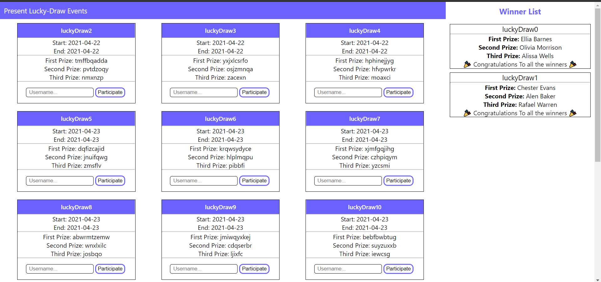

# Lucky Draw Gaming Service

This is a Gaming service to provide API's for lucky-draw gaming service. Helps to have a gaming event and participate using Tickets. Announces winner as the Lucky-draw ends and display it accordingly. 

## TechStack used
**Built With**
* Node.js
* Express.js
* React.js
* Mysql

## Requirements
1. [npm](https://www.npmjs.com/get-npm ) should be Installed
2. [MySql](https://www.mysql.com/downloads/) should be Installed


## Setting up the database

1. Make a database of name 'luckydraw' on Mysql.
2. Import database.sql file from the cloned folder it will create all the tables and add some dummy data in them.

## Installation
	
1.  Clone the code repository or download the zip.
	```properties
	git clone https://github.com/ujjwal-batra/Luckydraw_grofers.git
	```
2.  Now in the cloned directory go to server folder and run :
	```properties
	npm install 
	nodemon start
	```
3. Open Client folder on other terminal/cmd and run:
	```properties
	npm install
	npm start
	```

## Screenshots


## API endpoints
1. ``` /present-events ``` : provides the list of present and upcoming events
	ex: 
	```
	{
	    "ID": 4,
	    "Name": "Lucky Draw 1",
	    "StartTime": "2021-04-22T20:44:39.000Z",
	    "EndTime": "2021-04-22T21:44:39.000Z",
	    "FirstPrize": "Washing Machine",
	    "SecondPrize": "Realme XT",
	    "ThirdPrize": "Smart Watch"
	}
2. ``` /past-events ``` : provides the list of past events.
3. ``` /purchase ``` :  A post request allows user to purchase an Item and get a Raffle ticket (lucky draw ticket). Body for post request :
	  ```
	  {
		  userName: 'Your username'
	  }
		```
4. ``` /eventWinners ``` : It provides winner of all completed lucky draw.
	ex:
	```
	{
		"luckydraw": "luckyDraw0",
		"FirstPlace": "Ellia Barnes",
		"SecondPlace": "Olivia Morrison",
		"ThirdPlace": "Alissa Wells"
	}
	```
5. ``` /participate ``` : A post request allowing you to participate in a lucky draw event. body for post request :
	```
	{
		Name :  'Your username',
		eventID :  12
	}
	```